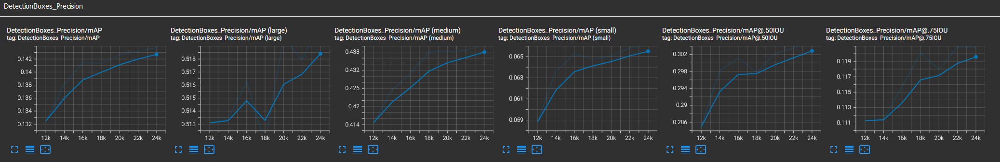

# Object Detection in an Urban Environment
On a fundamental level, all self driving cars need to have a precise and fast object detection and classification system in order to understand and reason about the world they 
will be driving in. The goal of this project is to train a convolutional neural network (CNN) 640x640 model to be able to detect and classify pedestrians, cyclists, and vehicles 
using data from the [Waymo Open Dataset](https://waymo.com/open/)

## Set up
I used my local setup, using a docker container running Ubuntu 20.04 with the following core packages installed:
* Tensorflow 2.5.0
* Matplotlib 3.5.2
* Numpy 1.19.5
  * Note: this had to be downgraded to 1.17.4 to be able to evaluate the model using the validation set
* Keras 2.5.0rc0
  * Note: I had to downgrade Keras from what came in the provided dockerfile

## Dataset
This project uses data from the [Waymo Open Dataset](https://waymo.com/open/), downloaded using the following command:
```
python download_process.py --data_dir ./data --size 100
```

### Dataset analysis
Before jumping in to any training, some exploratory data analysis is important to do in order to get an understanding of some of the properties of the dataset. The code in the 
'Exploratory Data Analysis.ipynb' Jupyter notebook shows visualizations of example images from the dataset, which reveal that the data was collected in a variety of light and weather 
conditions.

Example Daytime Image   |  Example Nigthtime Image
:----------------------------:|:---------------------------------------:
  |  
Example Rainy Image

 

In addition, these images show that there is a large spread in the types and density of objects in any given image. In the Jupyter notebook there is also code to get a handle on the 
average classification distribution and density across all of the records, shown below:


From the visualizations here, it is clear that this dataset presents a few challenges which will make it difficult to train a performant object detection model.

1. The size of the dataset is relatively small, meaning that the model might overfit the training data.
2. The variance in light and weather conditions means that there will be further challenges in achieving a generalizable model due to the increased variance
3. The class distribution is skewed heavily in favor of vehicles, though there is a sizeable amount of pedestrians present as well. There are very few cyclists, meaning the model will
not have a lot to go on when it comes to identifying them

The first two challenges can be solved by implementing data augmentations to increase the variability of the training set and therefore attempt to mitigate overfitting. The third challenge
is more difficult to overcome, with the the easiest solution being just to download more data.
*NOTE: The first two challenges can also be mitigated by being smart about splitting the test/train/val splits such that each split contains an equal proportion of sunny/rainy/nightime
records. If I were to do this project again, I would definitely attempt to do this. As it is my splits were created rather naively, which I have taken into account in the discussion below*

### Cross validation
In order to understand how well the models generalize to new data, I created a 75/15/10 split for train/validation/test respectively. While this is generally accepted to be good practice, for
this particular project, omitting the test set and splitting the data into 80/20 train/validation would have provided slightly better results. Unfortunately due to the time consuming nature
of the training, the 75/15/10 split was used for all experiments to keep things consistent.

The code for creating the splits can be run using the following command, which moved the data into three subdirectories in `./data` named `train`, `val`, and `test'.
```
python create_splits.py --data-dir ./data
```

## Training
In order to run the training code use the following:
```
python experiments/model_main_tf2.py --model_dir=experiments/reference/ --pipeline_config_path=experiments/reference/pipeline_new.config
```
Unfortunately due to memory limitations, running the evaluation code could not be done in parallel to the training, and so was not able to be used to adjust the training hyperparameters
while the model was being trained. The evaluation used the following code after the model was completely trained. In order to do so, the `checkpoint` file had to be modified to start at
each of the checkpoints created during training.

```
python experiments/model_main_tf2.py --model_dir=experiments/reference/ --pipeline_config_path=experiments/reference/pipeline_new.config --checkpoint_dir=experiments/reference/
```

### Reference experiment
The baseline reference experiment uses the Single Shot Detector (SSD) Resnet 50 640x640 model found in the TF Detection model zoo [here](https://github.com/tensorflow/models/blob/master/research/object_detection/g3doc/tf2_detection_zoo.md)
with the number of classes changed to 3, the batch size reduced to 2, and with 25,000 optimization steps.

#### Results


In all following figures, the orange represents the training performance and the blue represents the validation performance. From these results there are a few key takeaways:
* The model seems to be overfitting the training data, given the higher loss in the validation set
* The mAP is very low, likely due to the relatively small dataset provided
* The loss curve has a few large jumps. This could be due to the learning rate being too high, or the batch size being too low, or both

### Improvements
I attempted to improve upon the performance in two main ways. First is data augmentation, which we can use to increase the size and variability of the training set, leading to a more 
generalizable model. The second was to switch to a faster R-CNN base architecture, which, while slower, theoretically performs better for object detection tasks. 


I explored both of these solutions first with the default learning rate of 0.04, and then with a much smaller learning rate of 0.0004.
#### Experiment 0:
* Architecture: SSD Resnet 50 640x640
* Learning rate of 0.04
* Augmentations:
  * Random grayscale conversion with probability of 0.1
  * Random brightness adjustment with max_delta 0.1
  * Random contrast adjustment with values between 0.6 and 1.0
  * Random cropping as used in the reference pretrained config 


#### Experiment 1:
* Architecture: Faster R-CNN ResNet50 V1 640x640
* Learning rate of 0.04


#### Experiment 2:
* Architecture: SSD Resnet 50 640x640
* Learning rate of 0.0004
* Augmentations:
  * Random grayscale conversion with probability of 0.1
  * Random brightness adjustment with max_delta 0.1
  * Random contrast adjustment with values between 0.6 and 1.0
  * Random cropping as used in the reference pretrained config 




#### Experiment 3:
* Architecture: Faster R-CNN ResNet50 V1 640x640
* Learning rate of 0.0004


### Discussion
These experiments yielded mixed results, to say the least. One thing that absolutely helped in both cases was the lower learning rate, as seen by large jump in mAP in the last two experiments.
Surprisingly, the data augmentations combined with the lower learning rate in experiment 2 produced a less generalizable model, with the loss from the validation set being ~0.4 higher than
the training loss. I am not 100% sure why this could be, though I suspect one thing that could help is being smarter when creating the train/val splits, as perhaps an uneven amount of images
with poor lighting conditions ended up in one or the other, thus resulting in overfitting to one type of lighting condition. This is one of the key takeaways I believe, and something that I
would do better if I were to repeat this project.

Faster R-CNN  with a lowered learning rate produced results which appear to be more generalizable, however the loss function jumps around so much that it is hard to verify how
close the loss from the validation set is compared with the training loss. This high amount of fluctuation could indicate that the learning rate needs to be even lower, with perhaps a larger
number of optimization steps to compensate. Increasing the batch size might also help with the fluctuating loss, however this was not possible due to memory limitations. This is another aspect
which I would change if I were to continue attempting to make a better and better model, is to work with a higher powered machine capable of handling large batch sizes and more optimization steps.
